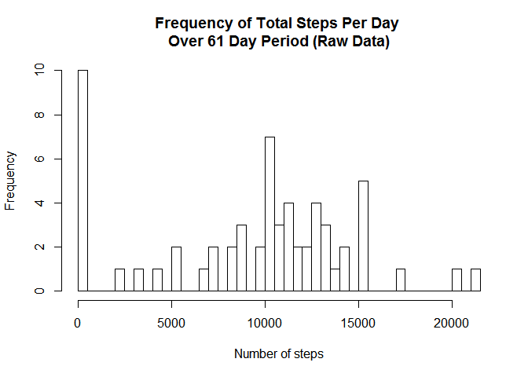
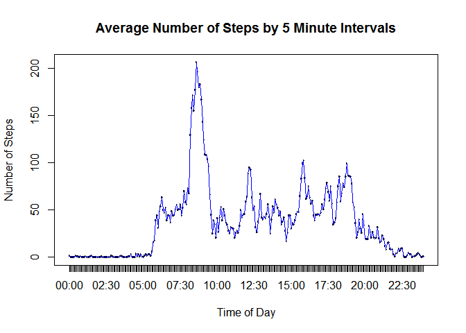
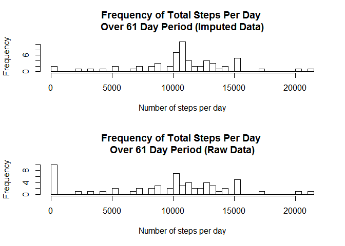
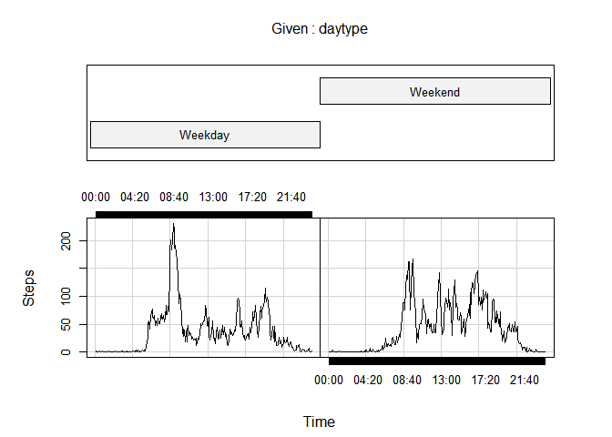

# PA1_template.Rmd
Dean Woodley  
Monday, December 26, 2016  
Loading and preprocessing the data
Show any code that is needed to Load the data

1: Code for reading in the dataset and/or processing the data


```r
    library(lubridate)
```

```
## 
## Attaching package: 'lubridate'
```

```
## The following object is masked from 'package:base':
## 
##     date
```

```r
    library(stringr)
    library(data.table)
```

```
## 
## Attaching package: 'data.table'
```

```
## The following objects are masked from 'package:lubridate':
## 
##     hour, isoweek, mday, minute, month, quarter, second, wday,
##     week, yday, year
```

```r
    library(chron)
```

```
## 
## Attaching package: 'chron'
```

```
## The following objects are masked from 'package:lubridate':
## 
##     days, hours, minutes, seconds, years
```

```r
    unzip("activity.zip")
    filename <- "activity.csv"

    activity <- read.csv(filename,header = TRUE)
    
    # Create datetime column from date and interval columns (needed????)
    activity$datetime <- str_c(as.character(activity$date),
        str_c(str_sub(str_pad(as.character(activity$interval),4,side="left",pad="0"),start=1,end=2),
          str_sub(str_pad(as.character(activity$interval),4,side="left",pad="0"),start=3,end=4),"00",
          sep=":"),sep=" ")
    
    activity$datetime <- as_datetime(activity$datetime,tz=Sys.timezone())

    # Create factors from intervals
    activity$interval.f <- factor(str_c(str_sub(str_pad(as.character(activity$interval),4,
                                side="left",pad="0"),start=1,end=2),
                                 str_sub(str_pad(as.character(activity$interval),4,
                                        side="left",pad="0"),start=3,end=4),sep=":"),ordered=TRUE)
```
2: Create a histogram of number of steps per day.

```r
    hist(tapply(activity$steps,activity$date,sum,na.rm=TRUE),breaks=50,
         xlab = "Number of steps",
         ylab = "Frequency",
         main = "Frequency of Total Steps Per Day \nOver 61 Day Period (Raw Data)")
```

<!-- -->

3:  Mean and median number of steps taken each day.

```r
    mean.steps <- round(mean(tapply(activity$steps,activity$date,sum,na.rm=TRUE)))
    median.steps <- median(tapply(activity$steps,activity$date,sum,na.rm=TRUE))
    
    print(str_c("Mean number of steps per day:",as.character(mean.steps),sep= " "))
```

```
## [1] "Mean number of steps per day: 9354"
```

```r
    print(str_c("Median number of steps per day:",as.character(median.steps),sep= " "))
```

```
## [1] "Median number of steps per day: 10395"
```

4:  Time series plot of the average number of steps taken

```r
    avg.steps.by.time <- tapply(activity$steps,activity$interval,mean,na.rm=TRUE,ordered=TRUE)
    
    t.avg.steps <- as.data.table(avg.steps.by.time)
    t.avg.steps$avg.steps.by.time <- round(t.avg.steps$avg.steps.by.time)
    t.avg.steps$interval <- row.names(avg.steps.by.time)
    t.avg.steps$interval <- str_pad(t.avg.steps$interval,4,side="left",pad="0")
    t.avg.steps$interval <- str_c(str_sub(t.avg.steps$interval,1,2),":",str_sub(t.avg.steps$interval,3,4))
    t.avg.steps$interval <- factor(t.avg.steps$interval,ordered = TRUE)
    
    plot(x = t.avg.steps$interval,
         y= t.avg.steps$avg.steps.by.time,
         main="Average Number of Steps by 5 Minute Intervals",
         ylab = "Number of Steps",
         xlab = "Time of Day",
         type = "l")
    lines(t.avg.steps$avg.steps.by.time,col="blue")    
```

<!-- -->
   
   
5:  The 5-minute interval that, on average, contains the maximum number of steps

```r
    max.interval <- t.avg.steps[t.avg.steps$avg.steps.by.time 
                                == max(t.avg.steps$avg.steps.by.time)]$interval

    print(str_c("Start of 5 minute interval with maximum average number of steps:",
                as.character(max.interval),sep= " "))
```

```
## [1] "Start of 5 minute interval with maximum average number of steps: 08:35"
```


6:  Code to describe and show a strategy for imputing missing data

```r
    num.missing.vals <- sum(is.na(activity$steps))
    imputed.activity <- activity
    if (num.missing.vals > 0)
    {
        for (x in t.avg.steps$interval) {
            imputed.activity[imputed.activity$interval.f==x & is.na(imputed.activity$steps),]$steps <- 
                round(t.avg.steps[t.avg.steps$interval==x,]$avg.steps.by.time)
        }
    }
```
7:  Histogram of the total number of steps taken each day after missing values are imputed

```r
    xpar <- par(mfrow = c(2,1))
    
    hist(tapply(imputed.activity$steps,imputed.activity$date,sum),breaks=50,
        xlab = "Number of steps per day",
        ylab = "Frequency",
        main = "Frequency of Total Steps Per Day \nOver 61 Day Period (Imputed Data)")

    hist(tapply(activity$steps,activity$date,sum,na.rm=TRUE),breaks=50,
         xlab = "Number of steps per day",
         ylab = "Frequency",
         main = "Frequency of Total Steps Per Day \nOver 61 Day Period (Raw Data)")
```

<!-- -->

```r
    par(xpar)
```
8:  Panel plot comparing the average number of steps taken per 5-minute interval across weekdays and weekends

```r
    imputed.activity$daytype <- factor("Weekday",levels=c("Weekday","Weekend"))
    imputed.activity[is.weekend(imputed.activity$datetime),]$daytype <- factor("Weekend")
    
    avg.steps.weekend <- tapply(imputed.activity[imputed.activity$daytype=="Weekend",]$steps,
                            imputed.activity[imputed.activity$daytype=="Weekend",]$interval.f,
                            mean,na.rm=TRUE,ordered=TRUE)
    avg.steps.weekend.t <- as.data.table(avg.steps.weekend)
    avg.steps.weekend.t$interval <- row.names(avg.steps.weekend)
    
    avg.steps.weekday <- tapply(imputed.activity[imputed.activity$daytype=="Weekday",]$steps,
                                imputed.activity[imputed.activity$daytype=="Weekday",]$interval.f,
                                mean,na.rm=TRUE,ordered=TRUE)
    
    avg.steps.weekday.t <- as.data.table(avg.steps.weekday)
    avg.steps.weekday.t$interval <- row.names(avg.steps.weekday)
    
    avg.steps.weekday.t$daytype <- factor("Weekday",levels=c("Weekday","Weekend"))
    avg.steps.weekend.t$daytype <- factor("Weekend",levels=c("Weekday","Weekend"))
    colnames(avg.steps.weekday.t) <- c("avg.steps","interval","daytype")
    colnames(avg.steps.weekend.t) <- c("avg.steps","interval","daytype")
    
    
    xsteps <- rbind(avg.steps.weekend.t,avg.steps.weekday.t)
    coplot(avg.steps ~ factor(interval)|daytype,data=xsteps,type = "l",
           ylab="Steps",xlab="Time")
```

<!-- -->


